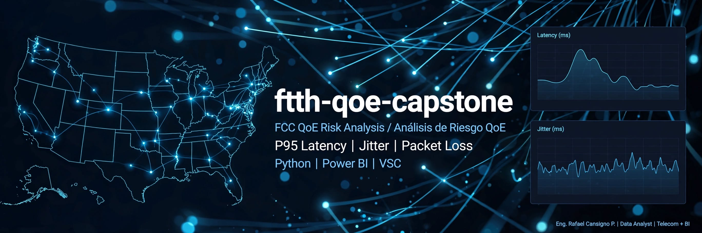

# ftth-qoe-capstone
### FCC QoE Risk Analysis / Análisis de Riesgo QoE

**Autor:** Eng. Rafael Cansigno P. | Data Analyst | Telecom + BI  
**Stack:** Python | Power BI | VSC | SQL

**KPIs:** P95 Latency | Jitter | Packet Loss

# FTTH QoE Risk Analysis

> Identifying fiber (FTTH) subscribers at risk of poor Quality of Experience (QoE) from FCC Measuring Broadband America telemetry, using a reproducible and auditable pipeline.

[](LICENSE)


**Author:** Rafael Cansigno Peláez · Google Data Analytics Capstone (Track B, self-directed) · September–October 2026

---

## 1. Project Summary

This project uses FCC Measuring Broadband America (MBA) telemetry from September 2022 to answer one question:

> Which FTTH units show degraded QoE during peak hours, and how much of that degradation is real versus an artifact of the measurement instrument or the analysis?

The analysis focuses on three metrics measured in the local evening peak window: latency (P95), jitter (P95) and packet loss.

We use Latency P95 instead of average because average hides the problem. Average lies, You can have 15ms average and still have 180ms spikes 5% of the time. The user doesn't remember the average, they remember the lag spike.

P95 = 95% of the time you were BELOW that value. It forces you to look at the tail of the distribution, which is where bad QoE lives.

**Current status:** Methodology v3.0 is specified (`docs/metrics_spec.md`). The pipeline is being rebuilt from the raw data. **No results are published yet**; they will be added only after the data inspection step and the Python ↔ Power BI reconciliation are complete.

## 2. Why Version 3 Was Necessary

The project went through two methodology iterations. Each one found a real problem, and the audit of the second one showed that patching it was less reliable than rebuilding it on a single, verified specification.

| Version | What it did | What it revealed |
| :--- | :--- | :--- |
| **v1** | Read the first 1,000 rows of each monthly FCC file | **Convenience bias:** the sample was dominated by legacy enrollments, not representative of the fleet |
| **v2 / v2.1.3** | Filtered FTTH units by hardware (285 → 258) and flagged risk by latency only | **Instrument bias solved:** legacy Whiteboxes (low CPU, FastEthernet) created false latency and loss. **New problem:** packet loss was computed from a raw count (`packets`) treated as a percentage |
| **v2.2** | Patched loss with `packets/10`, capped at 100%, and filled nulls with 0 | **Patch masked data issues** and left the two implementations inconsistent (details below) |
| **v3** | Single specification, single implementation, verified inputs | Current version |

### Findings that drove the rebuild

1. **Loss metric was not verified.** In v2.1.3, values such as `10055` were read as 1,005% loss. The v2.2 fix assumed 1,000 datagrams per test (`packets/10`) without confirming the field definition in the FCC data dictionary. Official MBA documentation describes latency tests sending roughly 2,000 packets per hour, which contradicts that assumption.
2. **Corrections hid problems instead of exposing them.** Capping values at 100% turned corrupt counters into "total loss", and `fillna(0)` made a unit with no data look perfect (0 ms latency, 0 ms jitter).
3. **Python and Power BI implemented the metrics differently.** The documented versions differed in the UTC offset used (`timezone_offset` vs `timezone_offset_dst`; September is under daylight saving time), the peak window (19:00–22:59 vs 19:00–23:59) and the loss source (`curr_udplatency` failures/successes vs `curr_udpcloss` packets). Matching totals could not prove they matched unit by unit.
4. **Risk thresholds changed without justification.** The flag moved from latency > 20 ms / jitter > 15 ms / loss > 1% to latency > 50 ms / jitter > 5 ms / loss > 1%. With the observed distribution, the jitter condition never triggered and the latency condition triggered for a single unit, so the result depended almost entirely on the unverified loss metric.
5. **Results were not reproducible from the repository.** The scripts that generated the datasets were not versioned, several documents cited files that did not exist, and key figures (units at risk, mean loss) differed across documents.

### What v3 changes

- **One specification** (`docs/metrics_spec.md`) that defines every metric, window and threshold. Code follows the spec, never the other way around.
- **One implementation** of each transformation, in Python. Power BI only visualizes the processed output.
- **Data inspection first:** column definitions and units are verified against the FCC documentation before any metric is computed.
- **No capping and no zero-filling.** Invalid records are excluded and counted in a data-quality log; units without enough data are reported separately, not scored.
- **Unit-level reconciliation** between Python and Power BI (per `Unit ID`, with explicit tolerances), instead of comparing totals.
- **Parameterized thresholds** with a sensitivity analysis. They are project-defined operating thresholds, not values attributed to a standard until verified in the source.

## 3. Methodology v3 (Summary)

Full definitions are in [`docs/metrics_spec.md`](docs/metrics_spec.md).

**Population**
- FTTH units from the FCC Sept 2022 unit profile (285), filtered to gigabit-capable Whitebox models (`skwb8`, `skwb8p`, `ac1750v2`) → **258 units**. The 27 excluded legacy units are kept for audit.
- Rationale: the Whitebox is the measurement instrument. A device that cannot forward traffic at line rate creates the degradation it reports.

**Peak window**
- `dtime` is UTC. Local time = `dtime + timezone_offset_dst`. Peak window: local hour ≥ 19 and < 23.

**Metrics (per unit, peak window only)**
- `p95_latency_ms`: 95th percentile of `rtt_avg` (µs → ms).
- `p95_jitter_ms`: 95th percentile of the average of up/down jitter (µs → ms).
- `loss_pct`: `sum(failures) / sum(successes + failures) × 100` (ratio of sums, weighted by packets).

**Risk definition (provisional)**
- `risk_flag = 1` if any metric exceeds its threshold. Thresholds live in `config.yaml` and are finalized after reviewing the observed distributions; a sensitivity table (latency × loss) is reported with every result.
- A second tier (`risk_severe`) separates extreme cases.

## 4. Tools

Python (pandas, DuckDB) · Parquet · Power BI · SQL Server (planned) · Excel · Visual Studio Code · Git/GitHub

## 5. Repository Structure

```
ftth-qoe-capstone/
├── data/
│   ├── reference/        # fiber_units.csv, excluded legacy units
│   ├── interim/          # Parquet intermediates (gitignored)
│   └── processed/        # final unit-level dataset
├── src/                  # pipeline (single implementation)
├── tests/                # data-quality and consistency tests
├── docs/
│   ├── metrics_spec.md   # source of truth for all metrics
│   ├── evidence/         # screenshots of the data preparation
│   └── lessons_learned.md
├── powerbi/              # dashboard (consumes processed data only)
├── archive/              # superseded material (v1, v2), not used by the pipeline
├── config.yaml           # thresholds and parameters
└── LICENSE
```

Raw FCC data (6.8 GB) is not stored in the repository. Its local path is set in `config.local.yaml` (gitignored).

## 6. Reproducibility

Raw data: FCC MBA validated data, September 2022 (13th Measuring Broadband America report), including `curr_udplatency.csv`, `curr_udpjitter.csv` and `curr_udpcloss.csv`.

1. Download and extract the three files listed above.
2. Set `raw_dir` in `config.local.yaml`.
3. Run the pipeline (command will be documented here once the pipeline is complete).
4. Validate with the tests in `tests/`.

## 7. Roadmap

- [x] Hardware filter and population definition (258 units)
- [x] Metrics specification v1.0.0
- [x] Repository restructure and archive of previous versions
- [ ] Data inspection of raw files (column definitions, units, `packets` field)
- [ ] Pipeline: raw → Parquet → unit-level metrics
- [ ] Data-quality log and automated tests
- [ ] Threshold selection from observed distributions, with sensitivity analysis
- [ ] Power BI dashboard and unit-level Python ↔ Power BI reconciliation
- [ ] Results and findings section

## 8. Limitations

- Single month (September 2022) and a non-random sample of volunteer units; results do not generalize to all FTTH subscribers.
- Hardware suitability is based on the nominal capability of each Whitebox model, not on a per-unit throughput test.
- Risk thresholds are project-defined and their sensitivity is part of the reported results.

## 9. Documentation Index

- [`docs/metrics_spec.md`](docs/metrics_spec.md): metric definitions, data quality rules, reconciliation protocol.
- [`archive/`](archive/): v1 and v2 findings, kept as a record of the iteration.
- [`docs/glossary_of_terms.md`](docs/glossary_of_terms.md): Glossary of terms.

## 10. License

MIT. See [LICENSE](LICENSE).