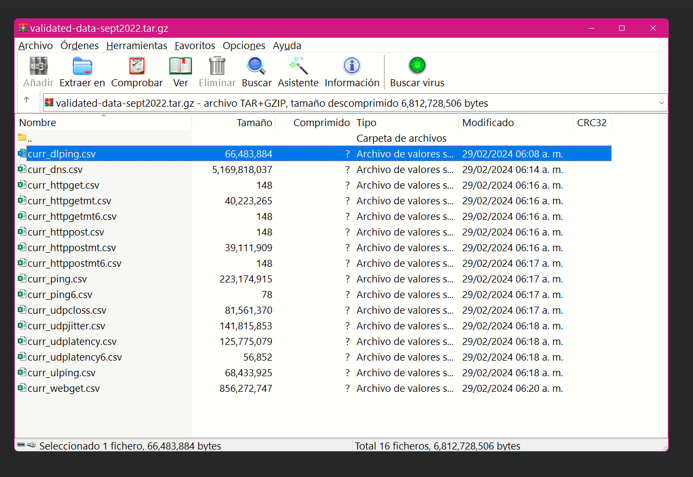
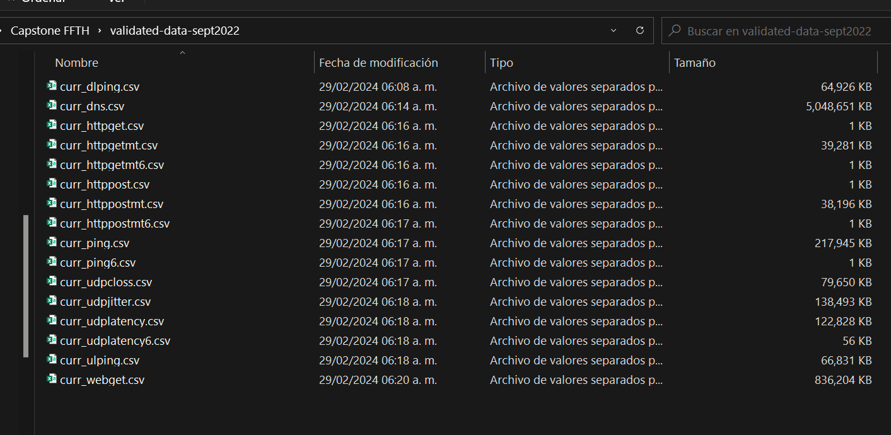
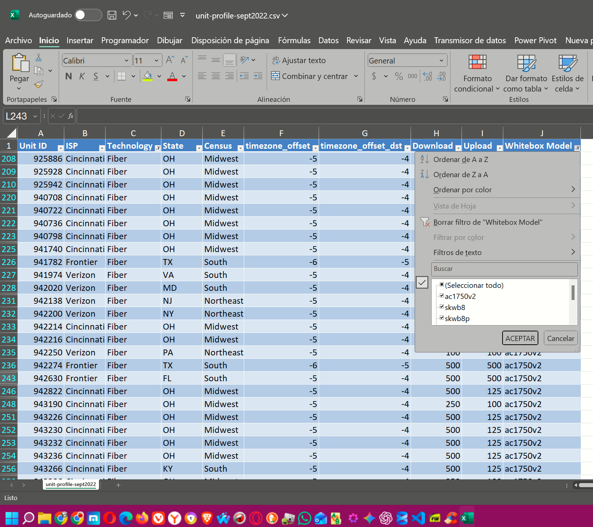

# Data Lineage & Inventory - FTTH QoE Risk Optimization v2.1 (Hardware-Corrected)

> **Project:** FTTH QoE Risk & Support Cost Optimization (Methodology v2.1 Hardware-Corrected)  
> **Author:** Eng. Rafael Cansigno Peláez | September 2026  
> **Capstone Track:** Google Data Analytics | Track B (Self-directed)  
> **Dataset:** validated-data-sept2022.tar.gz (6.8GB measurements) + unit-profile-sept2022.xlsx (inventory)

This document describes the full data lineage, from raw source to analysis-ready tables. Required for reproducibility under Google Data Analytics Framework - Prepare Phase. v2.1 corrects both Convenience Bias and Instrument Bias.

---

### 1. Raw Source - Measurements (What the 6.8GB TAR Actually Contains)

**Archive:** `validated-data-sept2022.tar.gz`
- **Compressed:** 6.8GB archive
- **Decompressed:** 6,812,728,506 bytes / 16 files
- **Source:** FCC MBA / SamKnows validated data - September 2022 - Thirteenth Report
- **Location (local, git-ignored):** `data/validated-data-sept2022/`

#### Evidence 1: TAR content (6.8GB total)

*File `validated-data-sept2022.tar.gz` shows total decompressed size 6,812,728,506 bytes. Largest files: curr_dns.csv 5,169,818,037 bytes (5GB), curr_webget.csv 856,272,747 bytes, curr_ping.csv 223,174,915 bytes.*

#### Evidence 2: Extracted file list (Explorer)

*Extracted folder contains 16 CSVs. Note *_t6.csv files are 1KB (empty IPv6 tests in this dump).*

#### Full Inventory - What the TAR Contains:
| File | Size (KB) | Description | Use in v2.1? |
| :--- | :--- | :--- | :--- |
| `curr_dlping.csv` | 64,926 | Download latency (ping) | NO |
| `curr_dns.csv` | 5,048,651 | DNS resolution time | **NO - 5GB, out of scope, not last-mile** |
| `curr_httpget.csv` | 1 | HTTP GET (IPv4) | NO - empty |
| `curr_httpgetmt.csv` | 39,281 | HTTP GET multithread | NO |
| `curr_httppost.csv` | 1 | HTTP POST | NO - empty |
| `curr_httppostmt.csv` | 38,196 | HTTP POST multithread | NO |
| `curr_ping.csv` | 217,945 | ICMP ping to test nodes | YES - baseline comparison |
| `curr_udpcloss.csv` | 79,550 | UDP packet loss % | YES - risk_flag secondary `>1.5%` |
| `curr_udpjitter.csv` | 138,493 | UDP jitter ms | YES - QoE degradation |
| `curr_udplatency.csv` | 122,828 | **UDP latency ms - PRIMARY** | **YES - CORE for P95 >80ms** |
| `curr_ulping.csv` | 66,831 | Upload latency | NO |
| `curr_webget.csv` | 836,204 | HTTP throughput / webget | NO - used incorrectly in v1, causes CPU bottleneck confusion |
| `*_t6.csv` / `*6.csv` | 1 | IPv6 variants | NO - empty |

**Decision v2.1:** Primary input is `curr_udplatency.csv` (122MB) + `curr_udpcloss.csv` + `curr_udpjitter.csv`. `curr_dns.csv` (5GB) and `curr_webget.csv` (836MB) are explicitly excluded to avoid hardware CPU bottleneck confusion and size issues.

### 2. Population File - `fiber_units.csv` - CORRECTED LINEAGE

**This file DOES NOT come from the 6.8GB TAR.**

**Fuente Primaria Oficial Verificada (30/09/2026):**
- **URL:** `https://data.fcc.gov/download/measuring-broadband-america/2023/unit-profile-sept2022.xlsx`
- **Archivo:** `unit-profile-sept2022.xlsx` - Thirteenth Measuring Broadband America Report (Sept-Oct 2022 validated data)
- **SHA256 (fiber_units.csv):** `b3ff35039876858b...` - 285 filas, 10 columnas
- **Local (git-tracked):** `data/fiber_units.csv`

**Schema real de este XLSX:**
| Column | Type | Description | Example | v2.1 Note |
| :--- | :--- | :--- | :--- | :--- |
| Unit ID | int | SamKnows Whitebox unique ID. Sequential by enrollment date | 447 | PK, orden histórico = proxy de hardware age |
| ISP | string | Provider | Verizon, Cincinnati Bell, Frontier | 3 únicos, estrato |
| Technology | string | Access tech | Fiber | **1 único - constante, irrelevante post-filtro** |
| State | string | US State | PA, NJ, VA | 17 únicos, opcional geo-dashboard |
| Census | string | Census region | Northeast, South | 4 únicos, redundante con State |
| timezone_offset | int | UTC offset | -5 | **Esencial para peak 19-23h local** |
| timezone_offset_dst | int | DST offset | -4 | **Esencial para peak** |
| Download | float | Provisioned down Mbps | 75, 100, 200, 250, 500 | Estrato, mean 335 total, 360 valid |
| Upload | float | Provisioned up Mbps | 75, 100... | |
| Whitebox Model | string | Whitebox hardware | skwb8, ac1750v2, wnr3500l-high | **Crítico para Hardware Capability Filter** |

### 2. Transformación a `fiber_units.csv`  - Proceso con Excel (Auditado)

**Fuente:** `unit-profile-sept2022.xlsx` (XLSX oficial FCC, no el TAR de 6.8GB)

**Proceso realizado en Excel (evidencia visual):**

1. Apertura de `unit-profile-sept2022.xlsx` → Hoja `unit-profile-sept2022`
2. Filtro 1 - Columna `Technology` = `Fiber` → 285 unidades FTTH (archivo intermedio `fiber_units.csv`)
3. Filtro 2 - Columna `Whitebox Model` IN (`ac1750v2`, `skwb8`, `skwb8p`) → 258 unidades Gigabit-capables
4. Copiado de filas visibles a hoja nueva (solo valores visibles)
5. `Datos > Quitar duplicados > Unit ID` → 0 duplicados, 258 únicos validados
6. Guardado como `CSV UTF-8 (delimitado por comas)` → `data/fiber_units.csv`

#### Evidencia: Filtrado por modelo en Excel (Hardware Capability Filter v2.1)

*Captura de Excel mostrando filtro activo en columna `Whitebox Model` con valores seleccionados `ac1750v2`, `skwb8`, `skwb8p`. Archivo fuente `unit-profile-sept2022.xlsx` .*

**Resultado del filtrado:**
- `fiber_units.csv` (final): 258 filas - Fiber + Hardware Gigabit
    - `skwb8`: 227 (88%)
    - `ac1750v2`: 28 (11%)
    - `skwb8p`: 3 (1%)
- `excluded_legacy_units.csv`: 27 filas excluidas (`wnr3500l-high`, `wdr3600`, `wr1043nd`, etc.)
  -All the excluded whiteboxes, it will be used to compare in the future

**Validación:**
- `Unit ID` únicos: 258
- Duplicados: 0
- Encoding: UTF-8
- `Technology` constante = `Fiber` (columna irrelevante post-filtro, mantenida solo en archivo intermedio para auditoría)